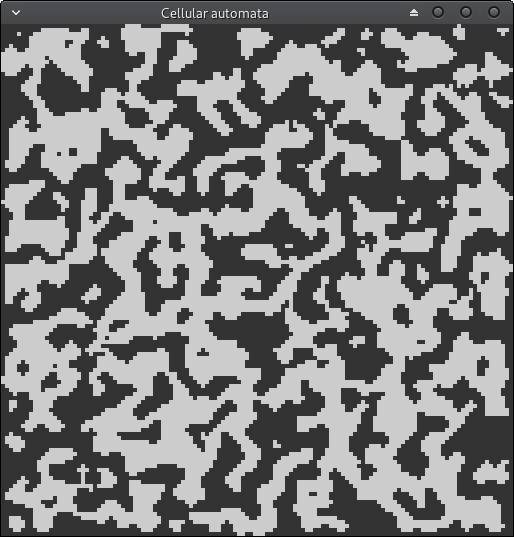
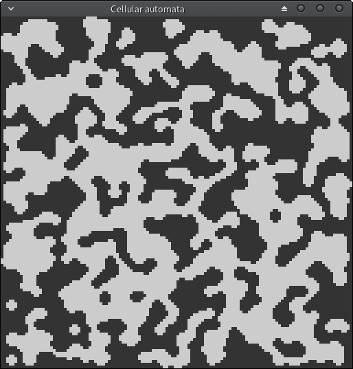

# Cellular automata 

Simple cellular automata cave generator using OpenGL compute shaders. Evolves from randomly initialized cells to cave-like structures.

Usage:
```
./main [probability to initialize cell alive] [step duration in ms]
./main 0.5 250
```

Dependencies:
- [GLFW](https://www.glfw.org/) - window creation
- [glm](https://glm.g-truc.net/0.9.9/index.html) - vector math



